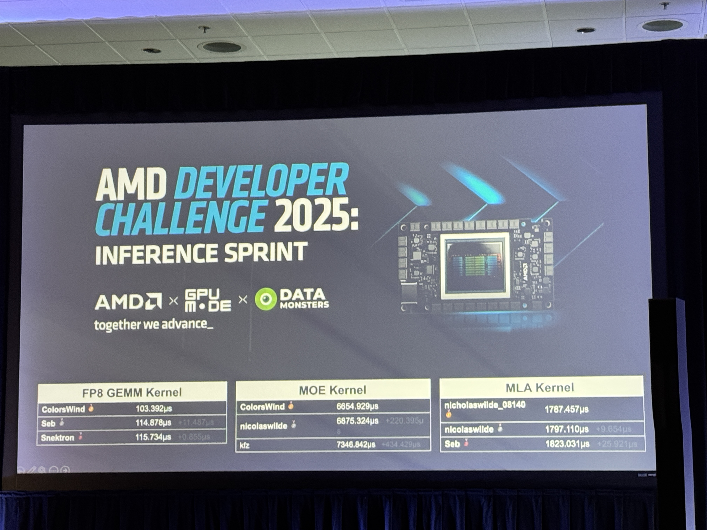

# AMD Developer Challenge 2025 Submissions

🥈 **2nd Place Winner** in AMD Developer Challenge 2025

**Ranked** 1st in MLA Decode, 2nd in MoE, and 5th in FP8 GEMM.



The full results:

- amd-fp8-mm: https://www.gpumode.com/leaderboard/399
- amd-mixture-of-experts: https://www.gpumode.com/leaderboard/430
- amd-mla-decode: https://www.gpumode.com/leaderboard/463

🥇 1st Place Solution from Colorswind: https://github.com/RadeonFlow/RadeonFlow_Kernels

## About AMD Developer Challenge 2025

https://www.datamonsters.com/amd-developer-challenge-2025

The challenge is a competition to develop high-performance kernels for AMD MI300X GPUs, including FP8 GEMM, MoE, and MLA Decode.

## About This Repository

This repository contains the submissions for the AMD Developer Challenge 2025.

The final submissions:

- [amd-fp8-mm-submission.py](./1-amd-fp8-mm/amd-fp8-mm-submission.py)
- [amd-moe-submission.py](./2-amd-moe/amd-moe-submission.py)
- [amd-mla-submission.py](./3-amd-mla-decode/amd-mla-submission.py)

**Note**: Other .py files are experimental/optimization attempts.

## Execution Guide

### Online Submission

Submit via GPU Mode Discord: https://discord.com/channels/1189498204333543425/1343002583001726986. Using:

- `/leaderboard submit test`
- `/leaderboard submit benchmark`
-  `/leaderboard submit ranked`

### Local Execution

**Prerequisites**:

- AMD MI300X GPU
- ROCm and PyTorch installed

**Steps**:

1. Clone the **reference repository**, which is the official code repository for the AMD Developer Challenge 2025:
   ```bash
   git clone https://github.com/gpu-mode/reference-kernels.git
   ```

2. Replace submission files in the cloned repository with the ones from this repository. **Taking `amd-fp8-mm` as an example**:
   - replace the content of `/reference-kernels/problems/amd/fp8-mm/submission.py` with the content of my `1-amd-fp8-mm/amd-fp8-mm-submission.py`

3. Create the tests file and add benchmarks.
    - create `/reference-kernels/problems/amd/fp8-mm/tests` file and add the benchmarks according to `/reference-kernels/problems/amd/fp8-mm/task.yml`:
        ``` yaml
        m: 1024; n: 1536; k: 7168; seed: 8135
        m: 1024; n: 3072; k: 1536; seed: 6251
        m: 1024; n: 576 ; k: 7168; seed: 12346
        m: 1024; n: 7168; k: 256 ; seed: 5364
        m: 1024; n: 7168; k: 2048; seed: 6132
        m: 1024; n: 4608; k: 7168; seed: 7531
        m: 1024; n: 7168; k: 2304; seed: 12345
        m: 1024; n: 512 ; k: 7168; seed: 6563
        m: 1024; n: 4096; k: 512 ; seed: 17512
        m: 6144; n: 1536; k: 7168; seed: 6543
        m: 6144; n: 3072; k: 1536; seed: 234
        m: 6144; n: 576 ; k: 7168; seed: 9863
        m: 6144; n: 7168; k: 256 ; seed: 764243
        m: 6144; n: 7168; k: 2048; seed: 76547
        m: 6144; n: 4608; k: 7168; seed: 65436
        m: 6144; n: 7168; k: 2304; seed: 452345
        m: 6144; n: 512 ; k: 7168; seed: 12341
        m: 6144; n: 4096; k: 512 ; seed: 45245
        ```

4. Modify the evaluation script to include the custom kernel.
    - add the following lines to `/reference-kernels/problems/amd/eval.py` (be careful that the mla-decode kernel has its own eval.py: `/reference-kernels/problems/amd/mla-decode/eval.py`):
        ```python
        import sys, os
        if sys.stdout is None:
            sys.stdout = open(os.devnull, 'w')
        if sys.stderr is None:
            sys.stderr = open(os.devnull, 'w')

        sys.path.append("./fp8-mm")
        from submission import custom_kernel
        ```

5. Run evaluation.
    ```bash
    POPCORN_FD=1 python eval.py benchmark ./fp8-mm/tests
    ```

## Acknowledgements

Thanks to the AMD Developer Challenge 2025 organizers and the the GPU Mode team for the opportunity to participate in this challenge. Thanks to Bingqing Guo, Daniel Huang, and Prithvi Mattur from AMD for their help and support during the competition. Thanks all.

愿永怀热爱。

May passion never fade.
